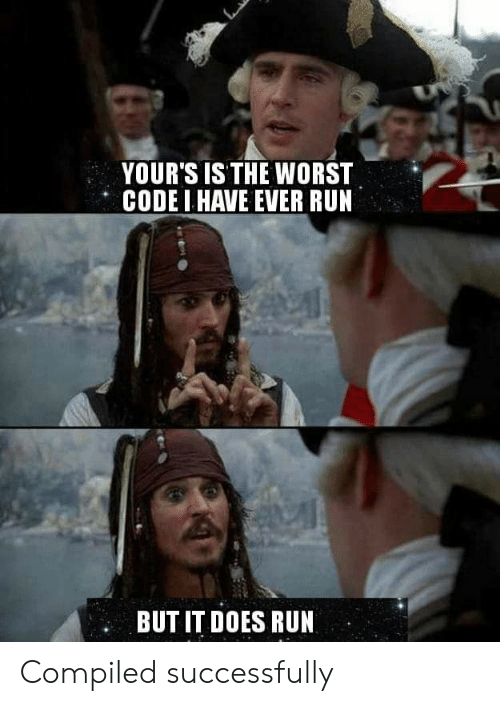

# This is the Pycharm Broker Game by PythonicInquisition


Authors: Daniel Ebert, Luca Müller, Luca Weissbeck, Ben Schaper, Jannik Sinz
- daniel.ebert@ibm.com, luca.mueller1@ibm.com, luca.weissbeck@ibm.com, ben.schaper@ibm.com, jannik.sinz@ibm.com
Project Start: 24.10.2020
Project End:

## Requirements
Python 3.5.2+

## BackEnd - Usage
To run the server, please execute the following from the BackEnd-root directory:

```
pip3 install -r requirements.txt
python3 -m swagger_server
```

## Test FrontEnd:

To test the frontend, have all requirements from FrontEnd/requirements.txt installed. Then first run the python file you want to test like follows: ```python3 depot_page.py``` and then run ```streamlit run depot_page.py```. This will run the streamlit server.

## Note about the Code:

